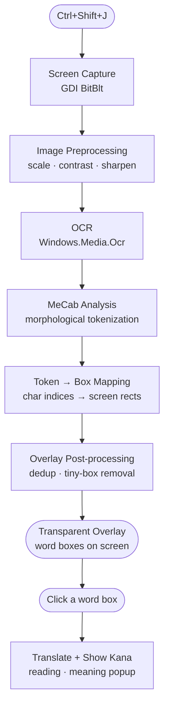

# JPLens

A lightweight Windows desktop app that captures your screen on demand, detects Japanese text, and renders a transparent clickable overlay. Click any word to see its reading and translation.

https://github.com/user-attachments/assets/27a8cbf5-c65a-4263-96d5-5f38e374b11d

---

## How to Run

1. Go to the [Releases](../../releases) page and download the latest `JPLens.zip`.
2. Extract anywhere — no installer needed.
3. Run `JPLens.exe`. A tray icon appears to confirm it's running.

| Action | Result |
|---|---|
| `Ctrl+Shift+J` | Capture screen and show word overlay |
| `Ctrl+Shift+J` again  | Dismiss overlay |
| Click a word box | Show reading (kana) + translation |
| Right-click tray icon | Exit |


### Requirements

- Windows 10 1803+ (build 17134+)
- Japanese OCR language pack
    - **Recommended:**
        1. Open **Settings** → **Time & Language** → **Language & Region**
        2. Click **Add a language** and search for **Japanese**
        3. After installing, click the Japanese language, choose **Language options**, and ensure **OCR** is installed ("Handwriting" or "OCR" component)
    - **Command line (alternative):**
        ```cmd
        dism /Online /Add-Capability /CapabilityName:Language.OCR~~~ja-JP~0.0.1.0
        ```

---

## Full Flow



---
